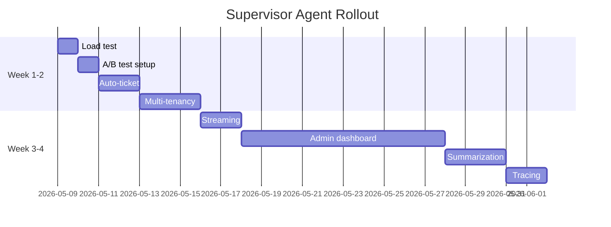

# Supervisor Agent Roadmap (Next 2–3 Months)

**Status:** Planning phase  
**Last Updated:** 2026-05-08  
**Current Readiness:** 9.5/10 ✅

---

## 🔥 Week 1–2: Validation & Quick Wins

| Task | Why | Effort | Priority |
|------|-----|--------|----------|
| Run load test (`k6 smoke test`) | Know system limits | 1 day | P0 |
| Enable reasoning loop for 10% users | Measure improvement | 1 day | P0 |
| Auto-create tickets from negative feedback | Close feedback loop | 2 days | P0 |
| Multi-tenancy KB (per team) | Isolate knowledge | 3 days | P1 |
| Add Prometheus alerts for pool exhaustion | Prevent outage | 1 day | P0 |

**Commands to execute:**
```bash
cd load_test && k6 run k6_smoke.js
echo "ENABLE_REASONING_LOOP=true" >> .env
echo "REASONING_LOOP_ROLLOUT_USER_PERCENT=10" >> .env
docker-compose restart supervisor
```

---

## ⚡ Week 3–4: UX & Monitoring

| Task | Why | Effort | Priority |
|------|-----|--------|----------|
| Streaming responses to Teams | Better user experience | 2 days | P1 |
| Admin dashboard (approvals + KB management) | Reduce operational load | 2 weeks | P1 |
| Conversation summarization | Handle long threads | 3 days | P1 |
| Langfuse/LangSmith tracing | Debug LLM calls | 2 days | P1 |
| SLA dashboard (response time, accuracy) | Track performance | 3 days | P2 |

---

## 🧠 Month 2–3: Intelligence & Scale

| Task | Why | Effort | Priority |
|------|-----|--------|----------|
| Autonomous learning (bandit approval) | Reduce manual work | 2 weeks | P2 |
| Multi-agent routing (IT, HR, Sales) | Higher accuracy per domain | 2 weeks | P2 |
| Integration hub (Jira, Confluence, SharePoint) | Richer context | 2 weeks | P3 |
| Custom Vietnamese embedding model | Better KB retrieval | 1 week | P3 |
| Cost optimization (smaller models for simple intents) | Reduce LLM costs | 1 week | P2 |

---

## 🎯 Immediate Actions (Next 48 Hours)

### 1. Run smoke test
```bash
k6 run load_test/k6_smoke.js
# Expected: <100ms p95, 0 errors
```

### 2. Enable A/B test
```yaml
# docker-compose.override.yml or .env
ENABLE_REASONING_LOOP=true
REASONING_LOOP_ROLLOUT_USER_PERCENT=10
REASONING_LOOP_ROLLOUT_SALT=your-random-salt
```

### 3. Auto-create tickets (code to add)
```python
# In src/services/feedback_learning_worker.py
async def _create_ticket(feedback: FeedbackPayload):
    await n8n_connector.create_ticket(
        title=f"KB Miss: {feedback.original_question[:50]}",
        description=feedback.comment or feedback.original_answer,
        requester_id=feedback.user_id
    )
```

### 4. Set up Prometheus alerts
```yaml
# config/prometheus_alerts.yml
- alert: DBConnectionPoolExhausted
  expr: supervisor_db_pool_checkouts_total - supervisor_db_pool_checkins_total > 80
  for: 2m
```

---

## 📈 Success Metrics

After completing Week 1–2, measure:

| Metric | Target | How to measure |
|--------|--------|----------------|
| p95 response time | <200ms | Prometheus histogram |
| Error rate | <0.5% | `supervisor_request_errors_total` |
| Feedback → ticket time | <5 min | Custom metric |
| Multi-tenant isolation | No cross-team leakage | Manual test |
| Reasoning loop improvement | >15% better confidence | A/B test comparison |

---

## 📋 Rollout Plan



---

## 🛑 Risk Mitigation

| Risk | Mitigation |
|------|------------|
| Reasoning loop increases latency | Rollout to 10% first, monitor p99 |
| Auto-ticket spam | Require 2 negative feedbacks before creating ticket |
| Multi-tenancy breaks existing | Feature flag + migration script |
| Load test fails | Run in staging first, not production |

---

## 🔗 Related Documentation

- [Feedback Guide](./docs/FEEDBACK_GUIDE.md)
- [Power Automate Setup](./docs/POWER_AUTOMATE_SETUP.md)
- [Deploy Guide](./DEPLOY_GUIDE.md)
- [API Reference](./docs/api.md)

---

**Next Review Date:** 2026-05-15  
**Owner:** Engineering Team